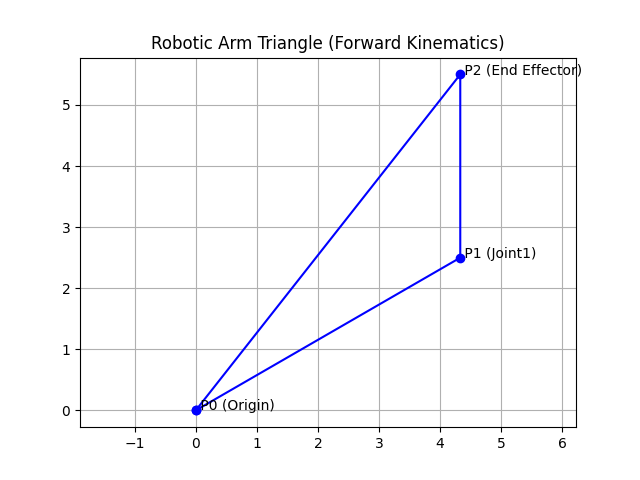

# Robotic Arm Simulation (2D)

This project simulates a simple 2D robotic arm using Python.

## Features
- Forward Kinematics: Input joint angles → get positions & plot arm.
- Inverse Kinematics: Input target (x,y) → compute angles & plot arm.
- Interactive menu loop (no need to restart program each time).

## Requirements
- Python 3.x
- NumPy
- Matplotlib

## 📸 Example Output
Here’s what the simulation looks like:




# Run it once with 
- python robotic_arm.py

In the terminal:

Press 1 → Enter new angles → Plot generated.

Press 2 → Enter new (x,y) → Plot generated.

Repeat as many times as you want.

Press 3 → Exit.


Install dependencies:
```bash
pip install numpy matplotlib

